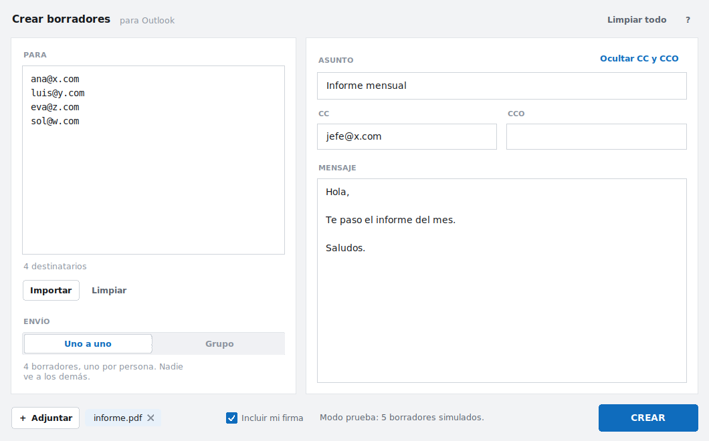
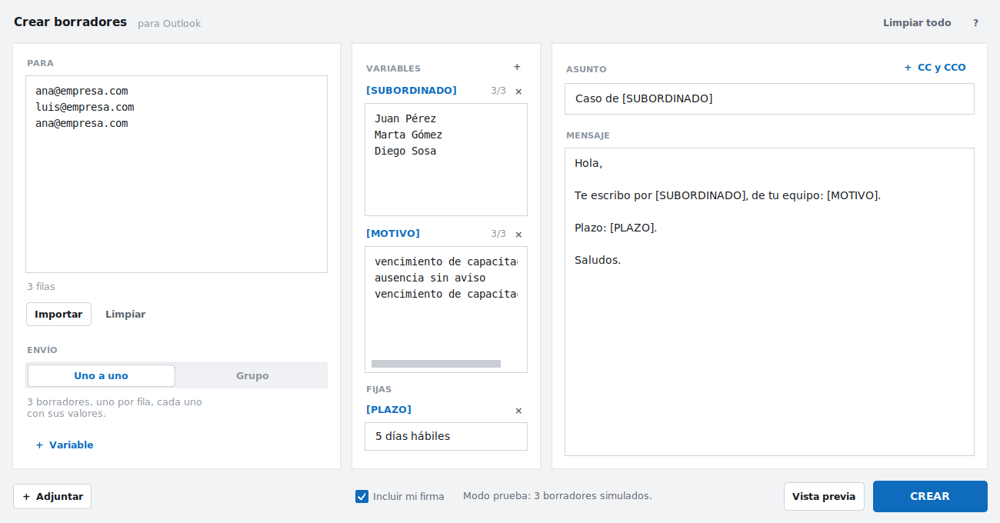
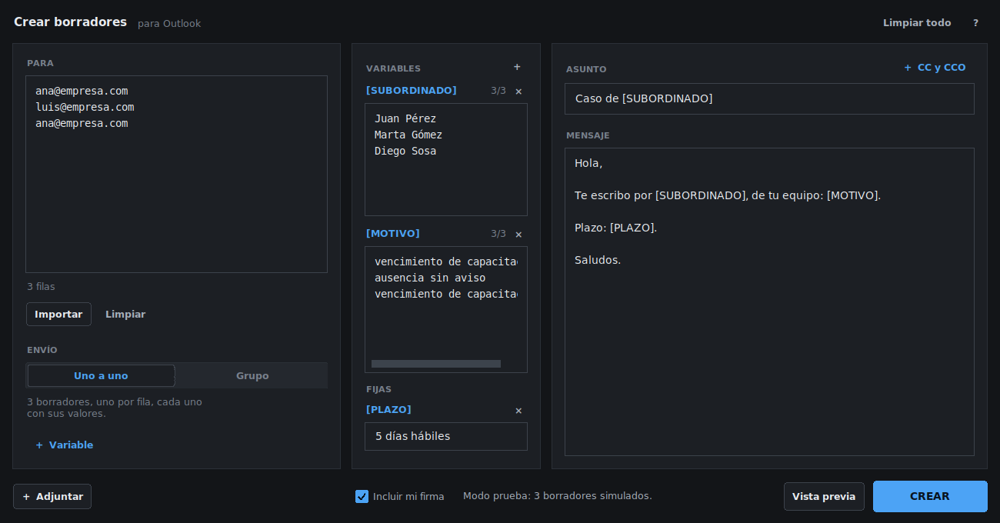

# CrearBorradores

App de ventana para Windows que arma **borradores de correo en Outlook**:
cargás los destinatarios, el asunto y el cuerpo, apretás **CREAR** y los
mensajes quedan en la carpeta *Borradores* de Outlook, listos para revisar
y enviar cuando quieras.




## Lo importante en tres líneas

- **Nunca envía nada.** La app solo guarda borradores; el envío lo hacés vos
  desde Outlook, mensaje por mensaje.
- **No pide usuario ni contraseña.** Usa la sesión de Outlook que ya tenés
  abierta en tu computadora. No guarda credenciales en ningún lado.
- **No necesita instalación.** Es un único `.exe`: se copia y se abre con
  doble clic, sin permisos de administrador.

## Requisitos

| | |
|---|---|
| Sistema | Windows 10 u 11 |
| Correo | **Outlook clásico de escritorio** (el de Microsoft 365 / Office 2016 o superior) con tu cuenta ya configurada |

> **Atención:** no funciona con el **"nuevo Outlook"** ni con **Outlook en el
> navegador**. Esas versiones no permiten que otros programas creen
> borradores. Si en tu Outlook ves arriba a la derecha un interruptor que
> dice *"Nuevo Outlook"* y está **activado**, desactivalo para volver al
> clásico. Si tu empresa solo tiene el nuevo Outlook, avisame y armamos la
> variante que usa Microsoft Graph (requiere registrar una app en Azure).

## Cómo se usa

1. Abrí Outlook (podés dejarlo abierto de fondo).
2. Abrí `CrearBorradores.exe`.
3. **PARA**: pegá o escribí los destinatarios, **uno por línea**. También
   acepta listas separadas por coma o punto y coma, y el formato
   `Nombre <correo@ejemplo.com>`. Abajo del cuadro se va actualizando un
   contador con cuántos destinatarios válidos hay.
4. Elegí **cómo se envía**:
   - **Correos únicos** → se crea **un borrador por persona**. Si cargaste
     30 direcciones, quedan 30 borradores separados y **nadie ve a los
     demás destinatarios**.
   - **Grupo (un solo correo)** → se crea **un solo borrador** con todos en
     el campo *Para*. Todos ven a todos.
5. Completá **ASUNTO** y **MENSAJE**.
6. Apretá **CREAR** (o `Ctrl + Enter`). Te muestra un resumen de lo que va a
   pasar antes de hacer nada. Si querés ver cómo queda cada correo, usá
   **Vista previa**.
7. Andá a Outlook → **Borradores**. Revisá y enviá.

### Funciones extra

- **Importar…**: carga los destinatarios desde un archivo `.xlsx`, `.csv`,
  `.tsv` o `.txt`. Si el archivo es una lista suelta de correos, busca
  direcciones en **todas las hojas y columnas**, saca los repetidos y los
  vuelca en el cuadro PARA. Si en cambio es una tabla con encabezados, cada
  columna extra se carga como variable (ver más abajo).
- **CC / CCO**: el tildado al lado de ASUNTO despliega los dos campos. En
  modo *correos únicos* la copia se repite en **cada** borrador (si son 30
  destinatarios, quien esté en CC recibe 30 correos cuando los envíes).
- **Adjuntar…**: los archivos elegidos se adjuntan a **todos** los
  borradores que se creen.
- **Incluir mi firma**: agrega tu firma de Outlook debajo del cuerpo. Si lo
  destildás, el cuerpo se escribe como texto plano y sin firma.
- La app recuerda tus preferencias (modo, firma, tamaño de la ventana) en
  `%APPDATA%\CrearBorradores\config.json`.

### Variables en el mensaje

Sirven para mandar el **mismo mensaje con un dato distinto en cada correo**:
por ejemplo avisarle a cada supervisor sobre su subordinado.

En el asunto y en el mensaje se escriben **entre corchetes**:

> Hola, te escribo respecto de **[SUBORDINADO]**, de tu equipo: **[MOTIVO]**.
> Tenés **[PLAZO]** para responder.



Hay dos tipos:

- **Por fila**: un valor distinto para cada borrador. La línea 1 de la
  variable se usa con la línea 1 de PARA, la 2 con la 2, y así.
- **Fijas**: el mismo valor en todos los borradores (por ejemplo `[PLAZO]`
  = *5 días hábiles*). Se escriben una sola vez.

**La forma más cómoda es importar una planilla.** Si el archivo tiene
encabezados, la app te muestra las columnas que encontró y elegís cuáles
convertir en variables (el nombre sale del encabezado):

| Supervisor | Subordinado | Motivo |
|---|---|---|
| ana@empresa.com | Juan Pérez | vencimiento de capacitación |
| luis@empresa.com | Marta Gómez | ausencia sin aviso |
| ana@empresa.com | Diego Sosa | vencimiento de capacitación |

Con esa planilla quedan `[SUBORDINADO]` y `[MOTIVO]` listas para usar. No
importa en qué columna esté el correo ni cómo se llame: la app la detecta
por el contenido.

Fijate en el ejemplo que **Ana aparece dos veces**: como elegiste un
borrador por fila, va a recibir **dos borradores separados**, uno por cada
subordinado.

También podés crear variables a mano con **+ Variable** y pegar los valores,
uno por línea (por ejemplo copiando una columna de Excel). Haciendo clic en
el nombre de una variable, se inserta en el mensaje donde tengas el cursor.

Tres cosas que la app controla sola, porque equivocarse acá significa
mandarle a un supervisor los datos de otro:

- Al lado de cada variable se ve un contador tipo **3/3** (valores cargados
  sobre filas). Si no coinciden, se pinta en naranja y **no te deja crear**
  los borradores hasta que lo arregles.
- Si una línea de PARA no tiene un correo válido, esa fila se saltea
  **junto con sus valores**, así las demás no se corren.
- El botón **Vista previa** te muestra cada borrador ya armado, con los
  valores reemplazados, antes de crear nada.

> Las variables por fila solo funcionan en modo **Uno a uno**. En modo grupo
> hay un solo borrador, así que no existe "una fila por destinatario"; ahí
> solo tienen sentido las fijas.

### Apariencia

Sigue el modo claro u oscuro que tengas configurado en Windows:



Para forzar uno de los dos, editá `%APPDATA%\CrearBorradores\config.json` y
poné `"theme": "light"` o `"theme": "dark"` (por defecto es `"auto"`).

## Cómo generar el `.exe` para repartir

### Opción A — en tu computadora

Necesitás [Python 3.10 o superior](https://www.python.org/downloads/)
instalado (tildá *"Add Python to PATH"* durante la instalación). Después:

```
build.bat
```

Doble clic al archivo y listo. Instala las dependencias, corre los tests y
deja el programa terminado en:

```
dist\CrearBorradores.exe
```

Ese **único archivo** es el que le pasás a cada persona (por mail, carpeta
compartida, OneDrive, lo que uses). No necesitan Python ni nada más.

### Opción B — que lo compile GitHub

El repositorio trae un flujo de GitHub Actions
(`.github/workflows/build.yml`) que corre los tests y compila el `.exe` en
una máquina Windows cada vez que se sube un cambio.

Para bajarlo: pestaña **Actions** → última ejecución → sección
**Artifacts** → `CrearBorradores-exe`.

## Problemas frecuentes

**"No se encontró Outlook de escritorio en esta computadora"**
No está instalado el Outlook clásico, o solo está el nuevo Outlook / la
versión web. Ver la nota de *Requisitos*.

**"Windows no pudo iniciar Outlook"**
Pasa cuando Outlook corre con permisos distintos a los de la app. Abrí
Outlook normalmente (sin *"Ejecutar como administrador"*) y probá de nuevo.

**"Outlook está ocupado y rechazó el pedido"**
Outlook tiene un cuadro de diálogo abierto esperando respuesta. Cerralo y
volvé a intentar.

**El antivirus bloquea el `.exe`**
Es un falso positivo típico de los ejecutables de un solo archivo. Si pasa
en tu empresa, pedile a IT que lo agregue a la lista de permitidos, o
generá la versión en carpeta cambiando `--onefile` por `--onedir` en
`build.bat` y repartí la carpeta comprimida.

**Tarda con muchos destinatarios**
Cada borrador es un pedido a Outlook. Con la firma activada tarda bastante
más, porque Outlook tiene que armar el HTML de la firma en cada mensaje. Si
vas a crear cientos, destildá *Incluir mi firma*. La ventana no se congela y
el botón CREAR se transforma en **CANCELAR** mientras trabaja.

## Para desarrolladores

```
CrearBorradores/
├── run.py                      punto de entrada
├── build.bat                   genera el .exe
├── src/crearborradores/
│   ├── ui.py                   la ventana (Tkinter)
│   ├── theme.py                paleta, tipografías y controles dibujados
│   ├── outlook.py              puente con Outlook por COM (pywin32)
│   ├── drafts.py               arma los mensajes y el HTML del cuerpo
│   ├── emails.py               parseo y validación de direcciones
│   ├── variables.py            variables [NOMBRE] del asunto y el cuerpo
│   ├── importers.py            importación desde Excel / CSV / TXT
│   └── config.py               preferencias del usuario
└── tests/                      tests (unittest, sin dependencias extra)
```

Correr desde el código fuente:

```bash
pip install -r requirements.txt
python run.py
```

Correr los tests:

```bash
python -m unittest discover -s tests -v
```

Los módulos `emails`, `importers` y `drafts` no dependen de Windows ni de
Tkinter, así que los tests corren en cualquier sistema operativo. Fuera de
Windows la app se abre igual, en **modo prueba**: simula la creación de los
borradores sin tocar Outlook.
